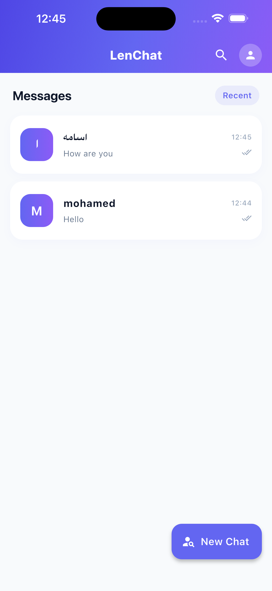
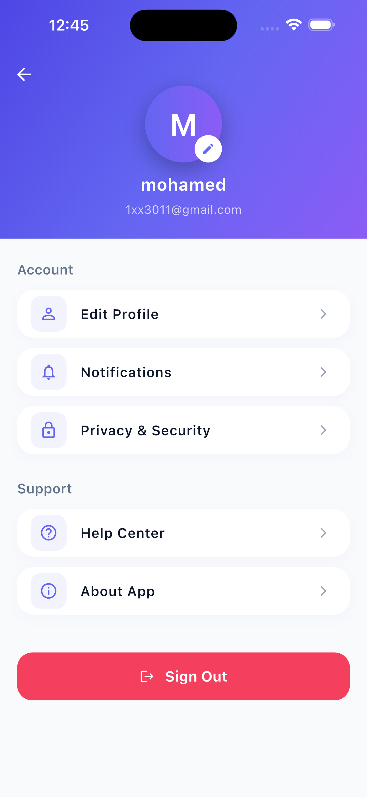
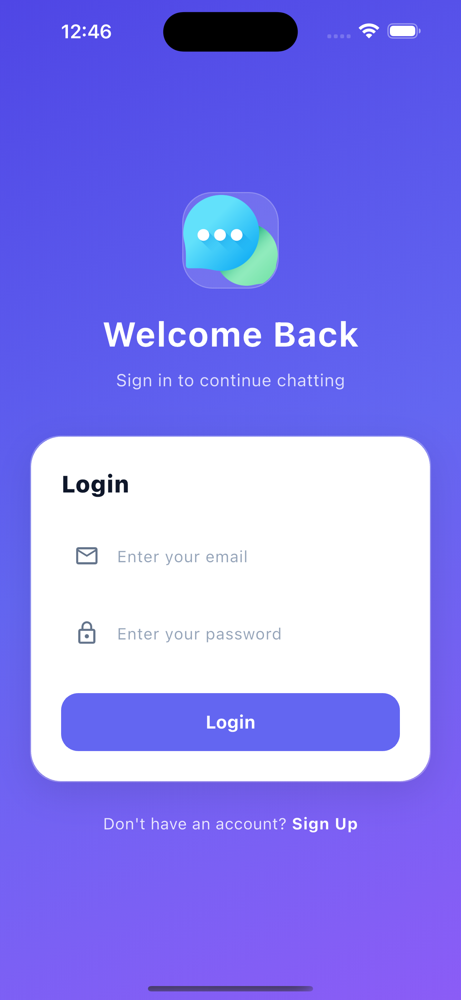

# 📱 Lenchat

<p align="center">
  
  <br>
  <b>A Cinematic, Real-Time Messaging Experience.</b>
  <br>
  <i>Built with Flutter & Firebase.</i>
</p>

---

## 🚀 Overview
**Lenchat** is a high-performance messaging application designed for seamless communication. It bridges the gap between powerful backend logic and a minimalist, noir-inspired UI. Engineered with **Flutter** and **Firebase**, it provides a fluid, real-time experience optimized for the modern mobile landscape.

## ✨ Key Features
* **Real-time Sync:** Instant messaging powered by **Cloud Firestore**.
* **Secure Access:** Robust user authentication via **Firebase Auth**.
* **Cinematic UI:** A minimalist, high-contrast Dark Mode design.
* **Persistent Sessions:** Stay connected with intelligent session management.
* **Optimized Performance:** Smooth animations and low-latency data handling.

## 📸 Visuals

|  |  |  |

## 🛠 Tech Stack
* **Frontend:** [Flutter](https://flutter.dev) (Dart)
* **Backend:** [Firebase](https://firebase.google.com) (Authentication, Firestore)
* **Design Philosophy:** Minimalist Noir / High-Contrast UI.

## ⚙️ Setup & Installation
To run **Lenchat** locally:

1. **Clone the repo:**
   ```bash
   git clone [https://github.com/Mohamed-Mewafy/lenpay.git](https://github.com/Mohamed-Mewafy/lenpay.git)
